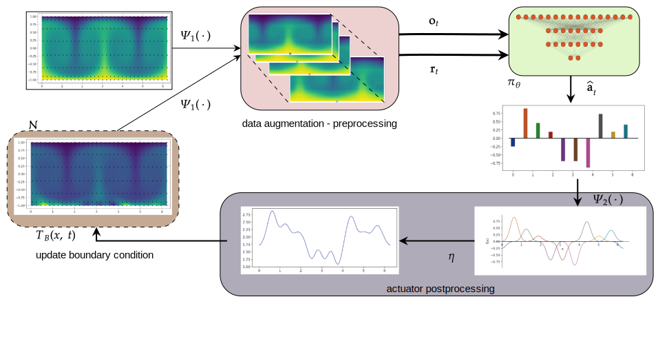

# Distributed control of Rayleigh-B&eacute;nard convection through symmetry exploiting deep reinforcement learning

(Codebase will be public soon...)

# Controlling 2D RBC
Uncontrolled case| Controlling via multi-agents
--|--
<video controls width="430" src="assets/Uncontrolled_Ra_1e4.mp4" title="Controlling RBC via multi-agents"></video> |<video controls width="430" src="assets/Controlling_Ra_1e4.mp4" title="Controlling RBC via multi-agents"></video>

# Training Paradigm

# Abstract
We present a convolutional framework which significantly reduces the complexity and thus, the computational effort for
distributed reinforcement learning control of dynamical systems governed by partial differential equations (PDEs). Exploiting
translational equivariances, the high-dimensional distributed control problem can be transformed into a multi-agent control
problem with many identical, uncoupled agents. Furthermore, using the fact that information is transported with finite velocity
in many cases, the dimension of the agents’ environment can be drastically reduced using a convolution operation over the
state space of the PDE, by which we effectively tackle the curse of dimensionality otherwise present in deep reinforcement
learning. In this setting, the complexity can be flexibly adjusted via the kernel width or by using a stride greater than one
(meaning that we do not place an actuator at each sensor location). Moreover, scaling from smaller to larger domains – or
the transfer between different domains – becomes a straightforward task requiring little effort. We use our framework to
study a particularly challenging and relevant PDE system, namely Rayleigh–Bénard convection. Employing low-dimensional
proximal policy optimisation (PPO) agents, we effectively reduce the Nusselt number of the system, which is a measure of
convective heat transfer. Furthermore, we show the agents trained in such a paradigm generalizes well not only to longer time
horizons, but also to increasingly chaotic flow regimes characterised by Rayleigh number (Ra) with little or no retraining.

